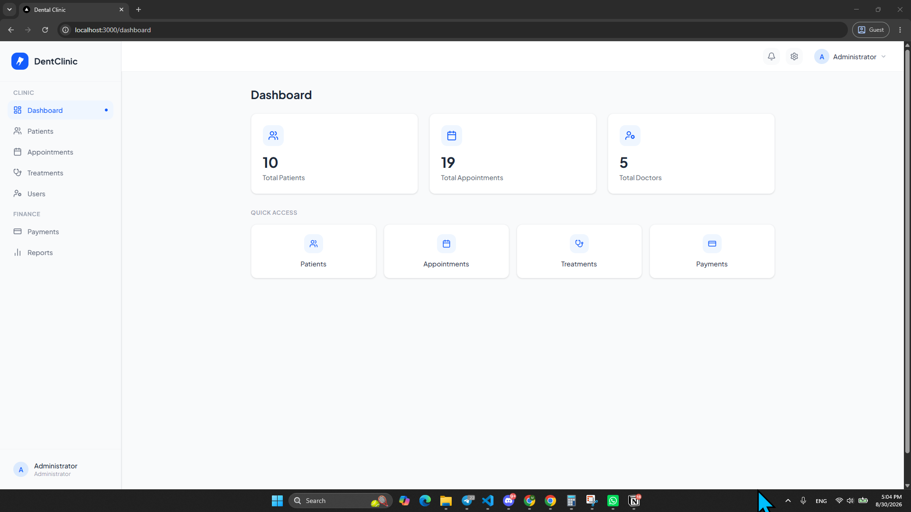
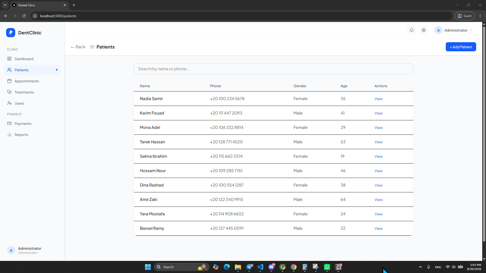
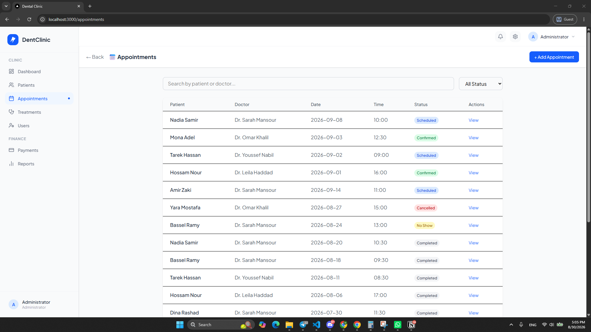
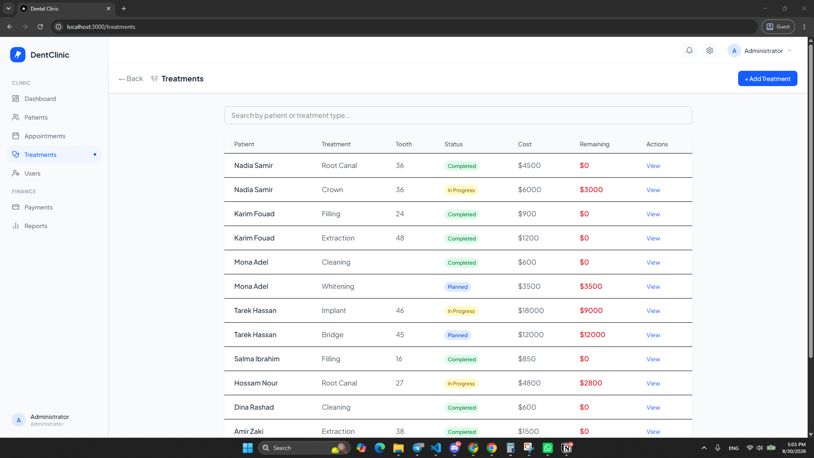
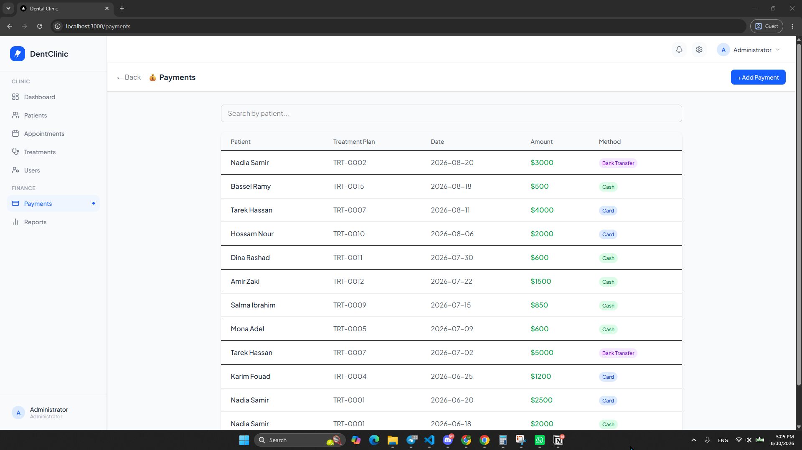
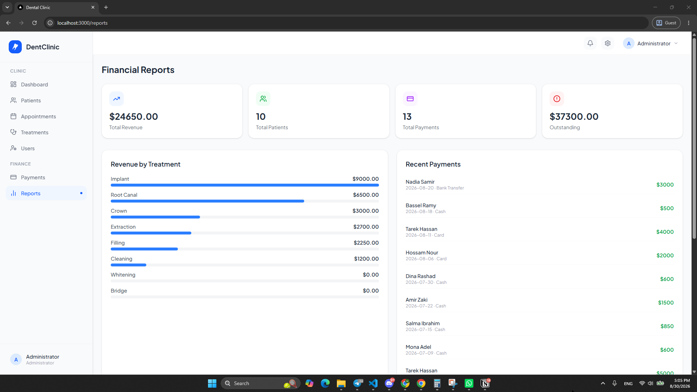
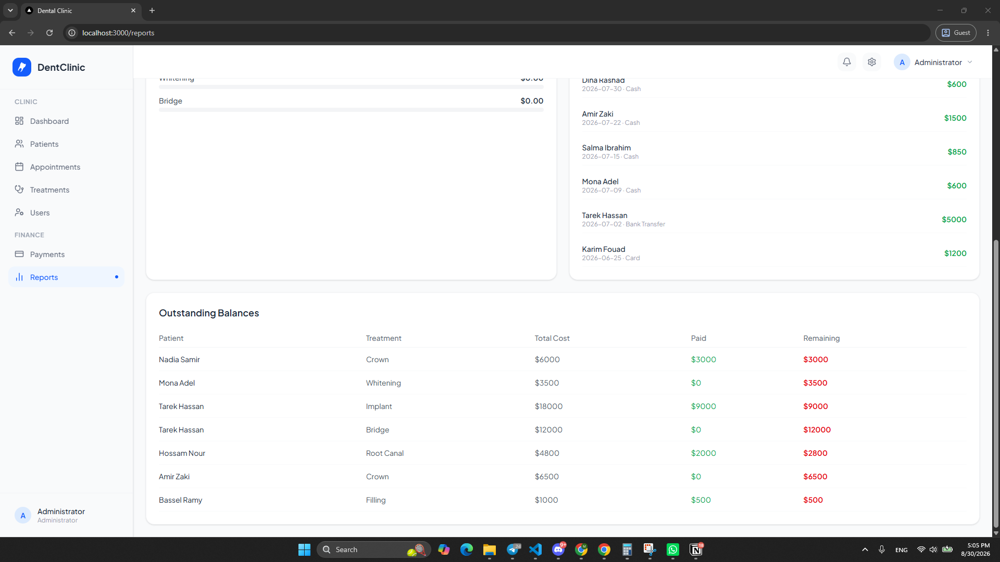
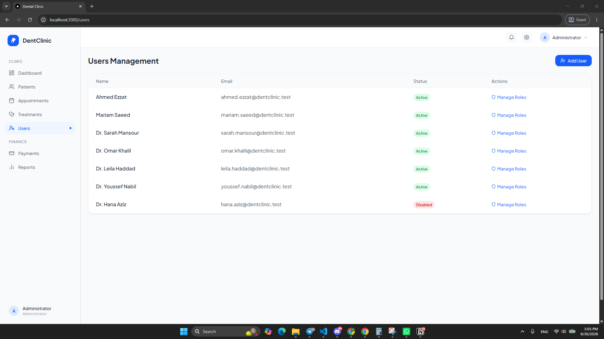
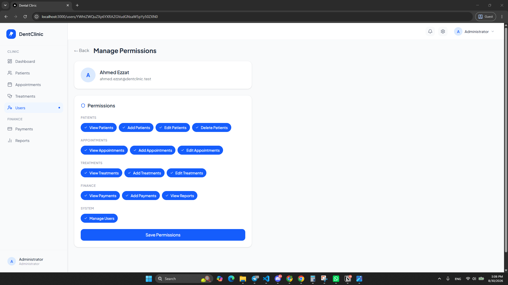
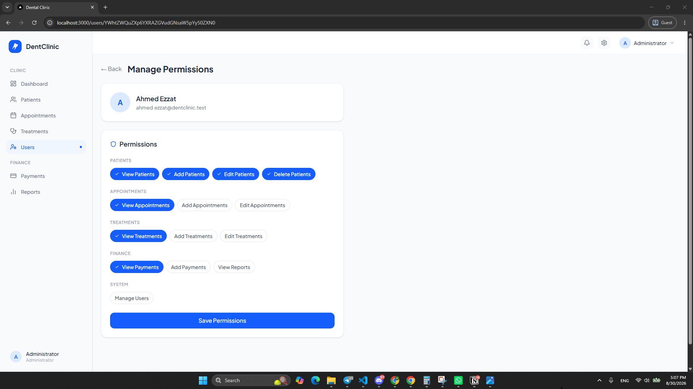

# DentClinic — Dental Clinic Management System

A dental clinic management system in two parts: a **Next.js 16 front end** (this repository) and a
**Frappe v16 back end** ([`ahmedraad51/clinic-system-backend`](https://github.com/ahmedraad51/clinic-system-backend)).

The front end covers the day-to-day running of a clinic — patients and their medical records, the
appointment book, treatment plans with per-tooth charting, payments and outstanding balances,
financial reports, and per-user permissions. The back end owns the data model, the money
calculations, role-based access, scheduled reports and WhatsApp appointment reminders.



> **Current state:** the front end runs on **built-in dummy data** and **login is switched off**, so
> you can clone it and see every screen without standing up Frappe first. Both are single flags —
> see [Running against the real backend](#running-against-the-real-backend).

---

## Table of contents

- [Architecture](#architecture)
- [Screens](#screens)
- [Front end](#front-end-this-repository)
  - [Stack](#stack)
  - [Routes](#routes)
  - [Project structure](#project-structure)
  - [The data layer](#the-data-layer)
- [Back end](#back-end)
  - [Doctypes](#doctypes)
  - [Roles and permissions](#roles-and-permissions)
  - [Reports, dashboards and WhatsApp](#reports-dashboards-and-whatsapp)
- [Getting started](#getting-started)
- [Running against the real backend](#running-against-the-real-backend)
- [Known gaps](#known-gaps)

---

## Architecture

```
┌─────────────────────────────┐
│  Browser                    │
│  React 19 client components │
└──────────────┬──────────────┘
               │  getList / getDoc / createDoc / updateDoc / deleteDoc
               ▼
┌─────────────────────────────┐
│  src/lib/frappe.ts          │   ← single access point for all data
│                             │
│   MOCK_DATA = true  ────────┼──►  src/lib/mockData.ts   (in-memory dummy data)
│   MOCK_DATA = false ────────┼──►  axios → /frappe/...
└──────────────┬──────────────┘
               │
               ▼
┌─────────────────────────────┐
│  Next.js rewrite            │   next.config.ts:
│  /frappe/:path*             │   → http://dent_clinic.localhost:8000/:path*
└──────────────┬──────────────┘
               │  cookie session + x-frappe-csrf-token
               ▼
┌─────────────────────────────┐
│  Frappe v16 · dent_app      │   REST: /api/resource/<Doctype>
│  Patient · Doctor ·         │         /api/method/login
│  Appointment · Treatment    │
│  Plan · Payment · …         │
└─────────────────────────────┘
```

Every page reaches the back end through `src/lib/frappe.ts` and nothing else — no page issues its
own `fetch`. That is what makes the dummy-data switch a one-line change.

---

## Screens

<table>
<tr>
<td width="50%"><br><b>Patients</b> — searchable by name or phone.</td>
<td width="50%"><br><b>Appointments</b> — filter by status; colour-coded badges.</td>
</tr>
<tr>
<td><br><b>Treatment plans</b> — type, tooth, cost and remaining balance.</td>
<td><br><b>Payments</b> — linked to a patient and a treatment plan.</td>
</tr>
</table>

### Financial reports

Revenue by treatment type, recent payments, and every plan still carrying a balance.





### Users and permissions

Staff accounts map onto Frappe users; each one gets a `Clinic Permission` record with fourteen
independent switches grouped by area.

<table>
<tr>
<td width="50%"></td>
<td width="50%"></td>
</tr>
<tr>
<td colspan="2"><br>A read-only account: view rights kept, everything else revoked.</td>
</tr>
</table>

---

## Front end (this repository)

### Stack

| | |
|---|---|
| Framework | Next.js **16.2.9**, App Router, Turbopack |
| UI | React **19.2.4**, TypeScript 5 |
| Styling | Tailwind CSS **v4** (via `@tailwindcss/postcss`) |
| Icons | `lucide-react`, `react-icons` |
| HTTP | `axios`, with cookies and the Frappe CSRF header |
| State | React Context (`AuthContext`) — no external store |

### Routes

| Route | What it does |
|---|---|
| `/` | Redirects to `/dashboard` |
| `/dashboard` | Patient / appointment / doctor counts, quick links |
| `/patients` | List with search by name or phone |
| `/patients/new` | Create — basic details plus medical history, allergies, medications |
| `/patients/[id]` | Record, financial summary and the dental chart |
| `/appointments` | List with search and a status filter |
| `/appointments/new` | Book — patient, doctor, date, time, reason |
| `/appointments/[id]` | Detail, plus one-click status changes |
| `/treatments` | Plans with cost and remaining balance |
| `/treatments/new` | Create — type, tooth number, diagnosis, cost |
| `/treatments/[id]` | Detail, status changes, shortcut to add a payment |
| `/payments` | Ledger of all payments |
| `/payments/new` | Record a payment (pre-fills from a treatment plan) |
| `/reports` | Revenue by treatment, recent payments, outstanding balances |
| `/users` | Staff accounts, add-user dialog |
| `/users/[id]` | The permission matrix for one user |

### Project structure

```
src/
├── app/
│   ├── layout.tsx              root layout → AuthProvider → MainLayout
│   ├── page.tsx                redirects to /dashboard
│   ├── _login/page.tsx         login screen, parked out of routing (see below)
│   ├── api/frappe/[...path]/   alternative proxy route handler (currently unused)
│   ├── dashboard/  patients/  appointments/  treatments/  payments/
│   ├── reports/    users/
│   └── globals.css
├── components/
│   ├── MainLayout.tsx          sidebar + topbar shell
│   ├── Sidebar.tsx             grouped navigation, active-route highlight
│   ├── Topbar.tsx              notifications, settings, profile menu
│   └── DentalChart.tsx         FDI-notation chart, 32 teeth, per-tooth status
├── context/
│   └── AuthContext.tsx         session state + the AUTH_DISABLED switch
└── lib/
    ├── frappe.ts               the only place that talks to the backend
    └── mockData.ts             in-memory dummy dataset
```

**The dental chart** (`DentalChart.tsx`) lays out all 32 permanent teeth in FDI notation — upper jaw
18→28, lower jaw 48→38. Clicking a tooth opens a small popover to mark it *Normal*, *Has Treatment*
or *Pending Treatment*. It accepts an optional `initialTeeth` map so a patient record can arrive with
its chart already marked.

### The data layer

`src/lib/frappe.ts` exposes five functions that mirror the Frappe REST API:

```ts
getList(doctype, fields, filters?)   // GET  /api/resource/<Doctype>?fields=…&filters=…
getDoc(doctype, name)                // GET  /api/resource/<Doctype>/<name>
createDoc(doctype, data)             // POST /api/resource/<Doctype>
updateDoc(doctype, name, data)       // PUT  /api/resource/<Doctype>/<name>
deleteDoc(doctype, name)             // DELETE
```

Each one reads the CSRF token from `localStorage` and sends it as `x-frappe-csrf-token`, with
`withCredentials: true` so the Frappe session cookie rides along.

**Dummy-data mode.** `MOCK_DATA = true` at the top of the file routes all five through
`src/lib/mockData.ts` instead — an in-memory store shaped like Frappe's REST responses: docs have a
`name` ID, link fields hold the linked doc's `name`, list queries return only the requested fields,
and a missing doc rejects the way a 404 would. It ships with 10 patients, 5 doctors, 19 appointments,
15 treatment plans, 13 payments and 9 users.

The money is *computed*, not hard-coded: payments sum into each plan's paid and remaining amounts,
and plans sum into each patient's totals. Add a payment and the plan, the patient card and the
reports page all move together. Cancelling a plan drops its outstanding balance to zero, and a new
patient's age is derived from the date of birth. Writes live for the browser session and reset on
reload.

---

## Back end

Repository: **[ahmedraad51/clinic-system-backend](https://github.com/ahmedraad51/clinic-system-backend)** ·
Frappe app `dent_app` · MIT

### Doctypes

| Doctype | Naming | Key fields |
|---|---|---|
| **Patient** | `PAT-{YYYY}-{#####}` | `full_name`, `gender`, `date_of_birth`, `age`, `phone_number`, `secondary_phone`, `email`, `address`, `medical_history`, `allergies`, `current_medications`, `chronic_diseases`, `notes` — plus read-only rollups `total_appointments`, `total_treatments`, `total_paid`, `total_remaining` |
| **Doctor** | `DOC-{#####}` | `full_name`, `specialization` (General Dentist / Orthodontist / Endodontist / Periodontist / Oral Surgeon / Pediatric Dentist / Prosthodontist), `phone_number`, `email`, `working_days`, `start_time`, `end_time`, `is_active` |
| **Appointment** | `APT-{YYYY}-{#####}` | `patient`, `doctor`, `appointment_date`, `appointment_time`, `duration_minutes`, `status` (Scheduled / Confirmed / Completed / Cancelled / No Show), `reason_for_visit`, `notes` |
| **Treatment Plan** | `TRT-{YYYY}-{#####}` | `patient`, `doctor`, `treatment_type` (Filling / Root Canal / Crown / Bridge / Extraction / Implant / Cleaning / Whitening), `tooth_number`, `status` (Planned / In Progress / Completed / Cancelled), `diagnosis`, `treatment_notes`, `total_cost`, read-only `paid_amount` and `remaining_amount` |
| **Treatment Session** | `SES-{YYYY}-{#####}` | `patient`, `treatment_plan`, `doctor`, `session_date`, `session_time`, `status`, `notes` |
| **Payment** | `PAY-{YYYY}-{#####}` | `patient`, `treatment_plan`, `payment_date`, `amount`, `payment_method` (Cash / Card / Bank Transfer), `notes` |
| **Clinic Permission** | one per `user` | 14 checkboxes: view/add/edit/delete patients, view/add/edit appointments, view/add/edit treatments, view/add payments, view reports, manage users |
| **Clinic Settings** | single | `clinic_name`, `logo`, contact details, `currency`, `tax_number`, working hours, `theme_color`, and feature switches for WhatsApp, the patient portal and financial reports |
| **WhatsApp Template** | `WAT-{#####}` | `template_name`, `trigger` (24 Hours Before / 2 Hours Before / Manual), `message`, `is_active` |
| **WhatsApp Log** | `WAL-{YYYY}-{#####}` | `patient`, `appointment`, `phone_number`, `status` (Sent / Failed / Pending), `sent_at`, `message`, `error_message` |

Balances are kept correct server-side: `Treatment Plan.validate()` recomputes `remaining_amount` and
refuses a paid amount greater than the total cost, then re-saves the linked patient so the rollups on
the patient record stay in step.

### Roles and permissions

Three roles ship as fixtures — **Clinic Manager**, **Clinic Doctor**, **Clinic Receptionist** — and
`Clinic Permission` layers the fine-grained switches on top, one record per user. That is exactly
what the `/users/[id]` screen edits.

### Reports, dashboards and WhatsApp

- **Query reports:** Daily Revenue, Monthly Revenue, Treatment Revenue, Outstanding Balances
- **Dashboard:** a *Clinic Dashboard* with Appointments Today, Monthly Revenue and Outstanding Balance charts, plus a *Dental Clinic* workspace
- **WhatsApp reminders:** `dent_app.dent_app.whatsapp.schedule_reminders` runs hourly, picks the active template for each trigger window, fills it from the appointment and logs the result to WhatsApp Log

---

## Getting started

### Front end only (dummy data — no backend needed)

```bash
git clone https://github.com/its14march/clinic-system-Front.git
cd clinic-system-Front
npm install
npm run dev
```

Open <http://localhost:3000> — it redirects straight to the dashboard, already populated.
Node **20.9+** is required (developed on Node 22).

### Back end

```bash
cd $PATH_TO_YOUR_BENCH
bench get-app https://github.com/ahmedraad51/clinic-system-backend --branch version-16
bench install-app dent_app
bench start
```

The front end expects the site to answer at `http://dent_clinic.localhost:8000`. If yours differs,
change the rewrite target in [`next.config.ts`](next.config.ts):

```ts
async rewrites() {
  return [{ source: "/frappe/:path*", destination: "http://<your-site>:8000/:path*" }];
}
```

---

## Running against the real backend

Two independent switches, both currently set for offline development:

**1. Turn dummy data off** — [`src/lib/frappe.ts`](src/lib/frappe.ts):

```ts
export const MOCK_DATA: boolean = false;
```

**2. Turn login back on** — [`src/context/AuthContext.tsx`](src/context/AuthContext.tsx):

```ts
const AUTH_DISABLED: boolean = false;
```

…then move the login page back into routing:

```bash
git mv src/app/_login src/app/login
```

The leading underscore makes `_login` a Next.js *private folder*, so the route is not published while
the code stays intact. With `AUTH_DISABLED = true` the app also seeds a stand-in `Administrator`
session (which is what keeps every page's `if (!user) → /login` guard quiet) and hides the logout
buttons, since there would be nowhere to log out to.

Logging in posts to `/api/method/login`, stores the returned `x-frappe-csrf-token` in `localStorage`,
and relies on the Frappe session cookie for everything after that.

---

## Known gaps

Worth knowing before you pick this up:

- **`npm run build` fails type-checking.** `src/app/api/frappe/[...path]/route.ts` types `params` as
  `{ path: string[] }`, but Next.js 16 requires `Promise<{ path: string[] }>`. Compilation itself
  succeeds, and `npm run dev` is unaffected. That route handler is also currently unused — everything
  goes through the `next.config.ts` rewrite instead.
- **Three linked routes do not exist yet:** `/settings` and `/profile` (from the topbar menu) and
  `/patients/[id]/edit` (from the patient page). There is no `/payments/[id]` detail page either.
- **Backend features with no UI yet:** Treatment Session, Clinic Settings, and the WhatsApp
  template/log doctypes are all defined server-side but not surfaced in the front end.
- **Dummy IDs read differently from real ones.** The mock names patients and doctors by their full
  name so tables read nicely; the real backend names them `PAT-2026-00001` and `DOC-00001`. Columns
  that show a link field will look different once `MOCK_DATA` is off.
- **The dental chart is not persisted.** Saving it currently logs to the console; there is no
  matching field on the Patient doctype yet.
