# DentClinic — Dental Clinic Management System

A dental clinic management system in two parts: a **Next.js 16 front end** (this repository) and a
**Frappe v16 back end** ([`ahmedraad51/clinic-system-backend`](https://github.com/ahmedraad51/clinic-system-backend)).

The front end covers the day-to-day running of a clinic — patients and their medical records, the
appointment book, treatment plans with sessions and per-tooth charting, payments with printable
receipts, financial reports, WhatsApp reminder templates, clinic settings, and per-user permissions. The back end owns the data model, the money
calculations, role-based access, scheduled reports and WhatsApp appointment reminders.

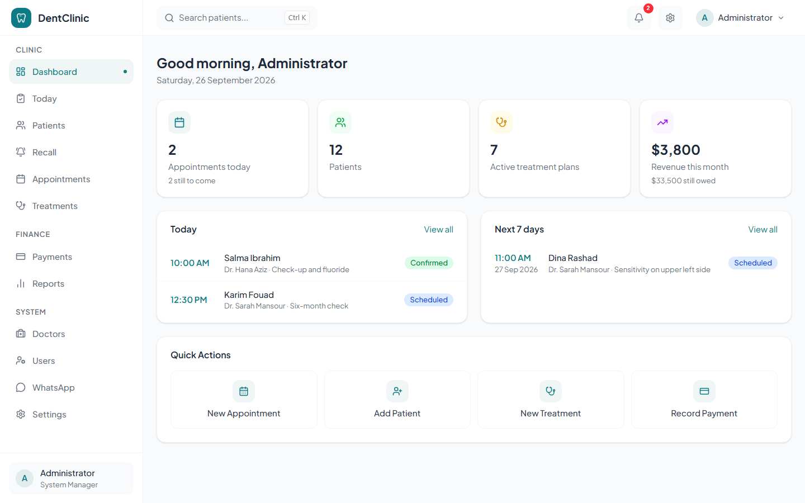

> **Current state:** the front end runs on **built-in dummy data** and **login is switched off**, so
> you can clone it and see every screen without standing up Frappe first. Both are single flags —
> see [Running against the real backend](#running-against-the-real-backend). To see the app as a
> receptionist or a doctor, open **Profile → Try Another User**.

---

## Table of contents

- [Architecture](#architecture)
- [Screens](#screens)
- [Front end](#front-end-this-repository)
  - [Stack](#stack)
  - [Routes](#routes)
  - [Project structure](#project-structure)
  - [The data layer](#the-data-layer)
- [Back end](#back-end)
  - [Doctypes](#doctypes)
  - [Roles and permissions](#roles-and-permissions)
  - [Reports, dashboards and WhatsApp](#reports-dashboards-and-whatsapp)
- [Getting started](#getting-started)
- [Running against the real backend](#running-against-the-real-backend)
- [Known gaps](#known-gaps)

---

## Architecture

```
┌─────────────────────────────┐
│  Browser                    │
│  React 19 client components │
└──────────────┬──────────────┘
               │  getList / getDoc / createDoc / updateDoc / deleteDoc
               ▼
┌─────────────────────────────┐
│  src/lib/frappe.ts          │   ← single access point for all data
│                             │
│   MOCK_DATA = true  ────────┼──►  src/lib/mockData.ts   (in-memory dummy data)
│   MOCK_DATA = false ────────┼──►  axios → /frappe/...
└──────────────┬──────────────┘
               │
               ▼
┌─────────────────────────────┐
│  Next.js rewrite            │   next.config.ts:
│  /frappe/:path*             │   → http://dent_clinic.localhost:8000/:path*
└──────────────┬──────────────┘
               │  cookie session + x-frappe-csrf-token
               ▼
┌─────────────────────────────┐
│  Frappe v16 · dent_app      │   REST: /api/resource/<Doctype>
│  Patient · Doctor ·         │         /api/method/login
│  Appointment · Treatment    │
│  Plan · Payment · …         │
└─────────────────────────────┘
```

Every page reaches the back end through `src/lib/frappe.ts` and nothing else — no page issues its
own `fetch`. That is what makes the dummy-data switch a one-line change.

---

## Screens

The pictures are taken from the running app with the dummy data (`npm run screenshots:readme`).

<table>
<tr>
<td width="50%">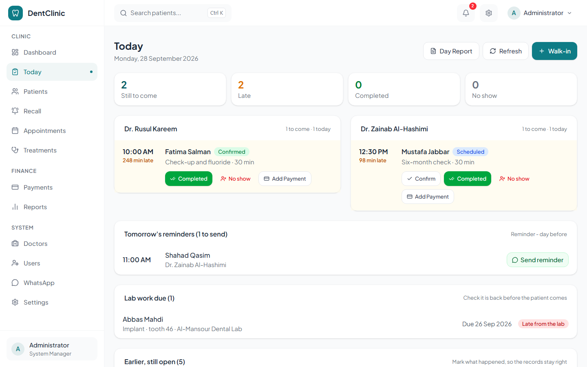<br><b>Today</b> — the front desk's day by doctor: one tap to confirm, complete or mark a no-show, late patients highlighted, balances and quick payments.</td>
<td width="50%">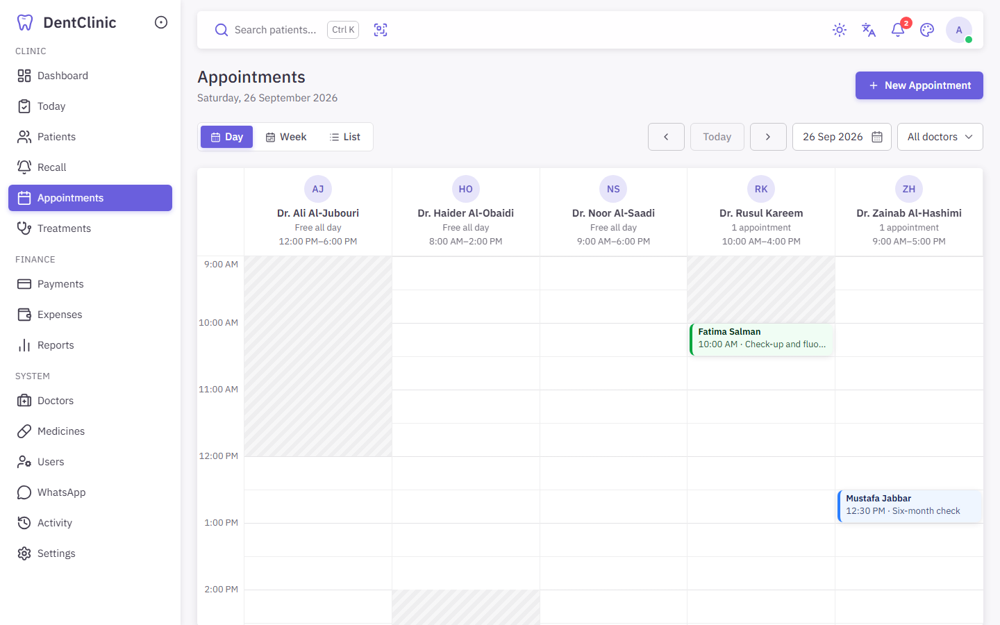<br><b>Appointments</b> — a day calendar with a column per doctor and their working hours; click a free time to book, drag to move.</td>
</tr>
<tr>
<td>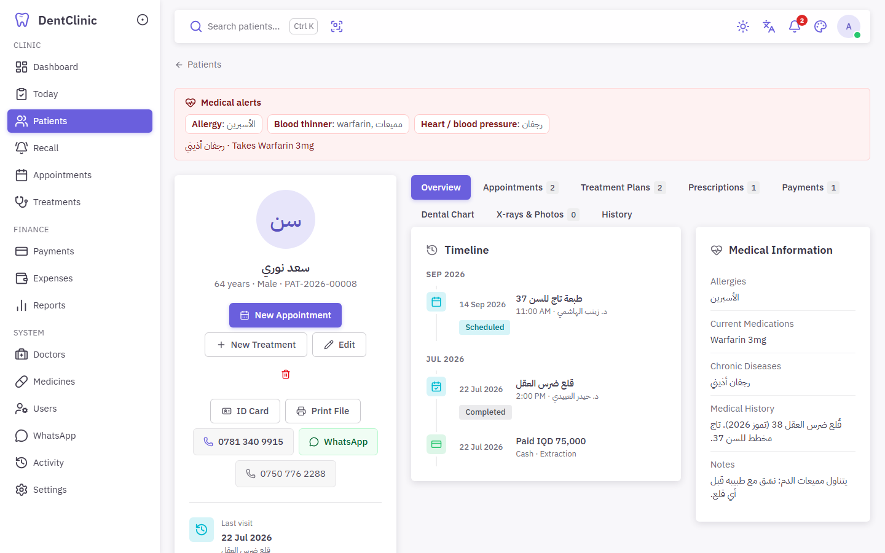<br><b>Patient</b> — medical alerts on top, call and WhatsApp, last and next visit, balance, and a timeline.</td>
<td>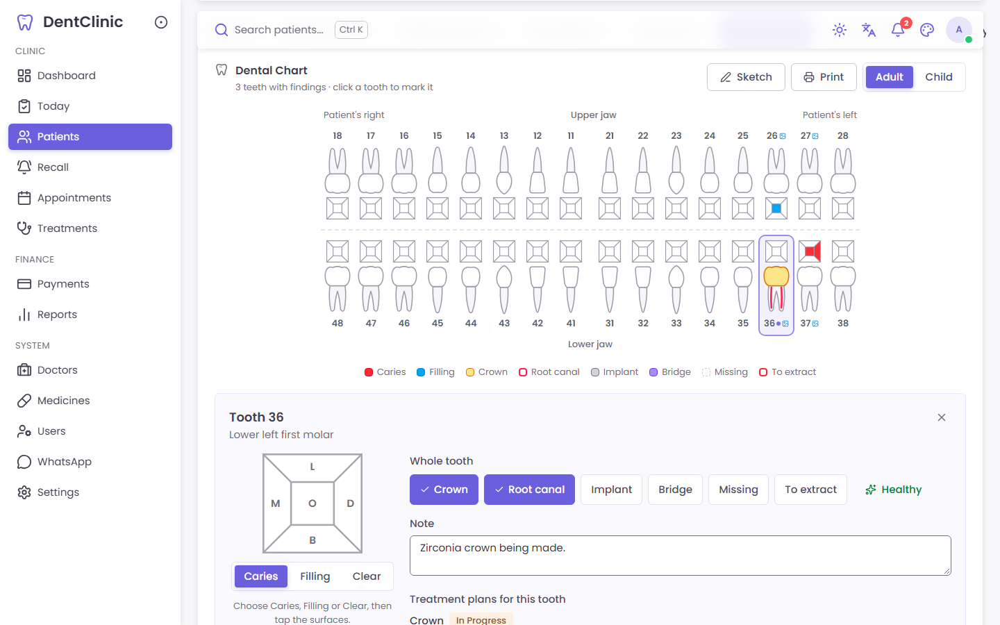<br><b>Dental chart</b> — adult and child teeth, the five surfaces, crowns, root canals, implants and more, with a note per tooth.</td>
</tr>
<tr>
<td>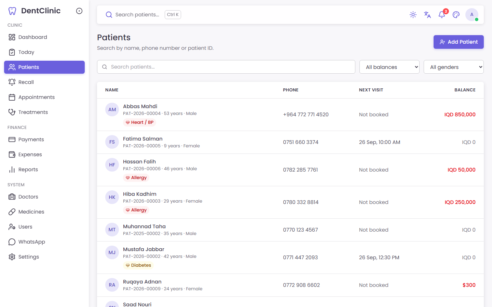<br><b>Patients</b> — search by name, phone or ID; alerts and the next visit at a glance.</td>
<td>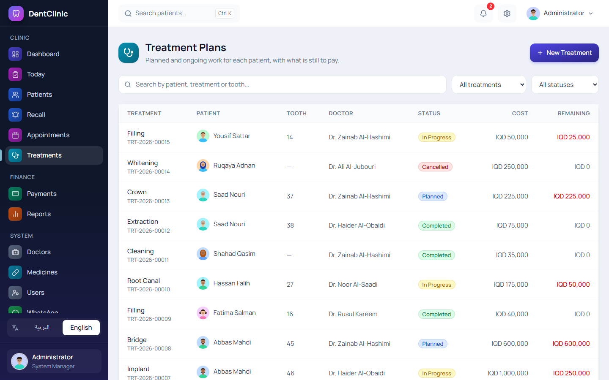<br><b>Treatment plans</b> — type, tooth, cost and remaining balance.</td>
</tr>
<tr>
<td>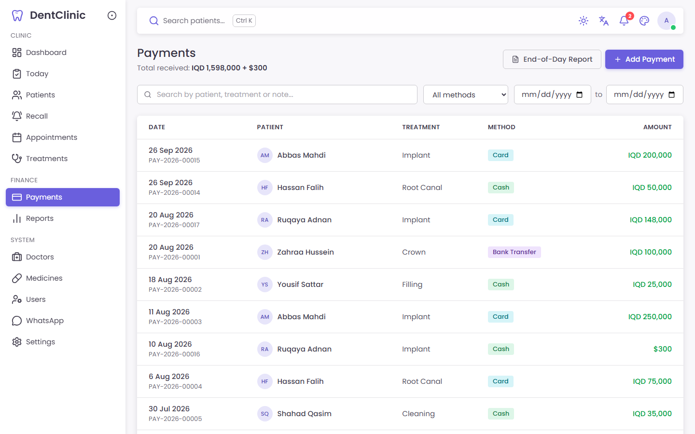<br><b>Payments</b> — linked to a patient and a plan, with printable receipts and an end-of-day report.</td>
<td><br><b>Dashboard</b> — today, the next seven days, and the month's money.</td>
</tr>
</table>

### Financial reports

Revenue by treatment type, recent payments, and every plan still carrying a balance.

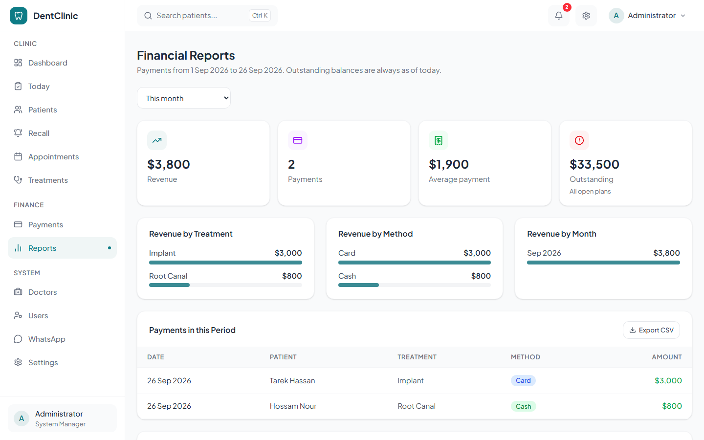

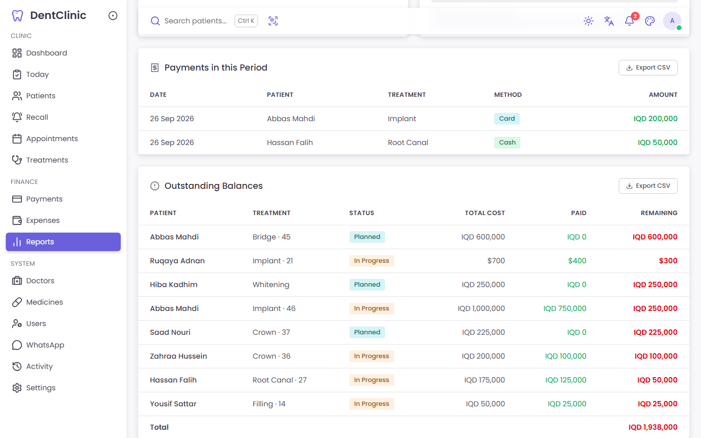

### Users and permissions

Staff accounts map onto Frappe users; each one gets a `Clinic Permission` record with fourteen
independent switches grouped by area.

<table>
<tr>
<td width="50%">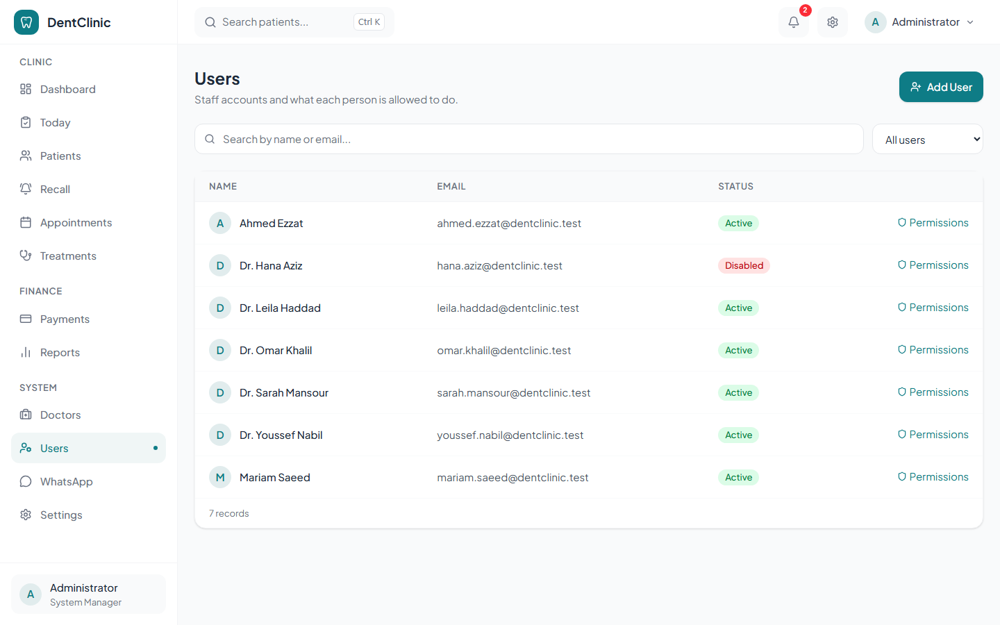</td>
<td width="50%">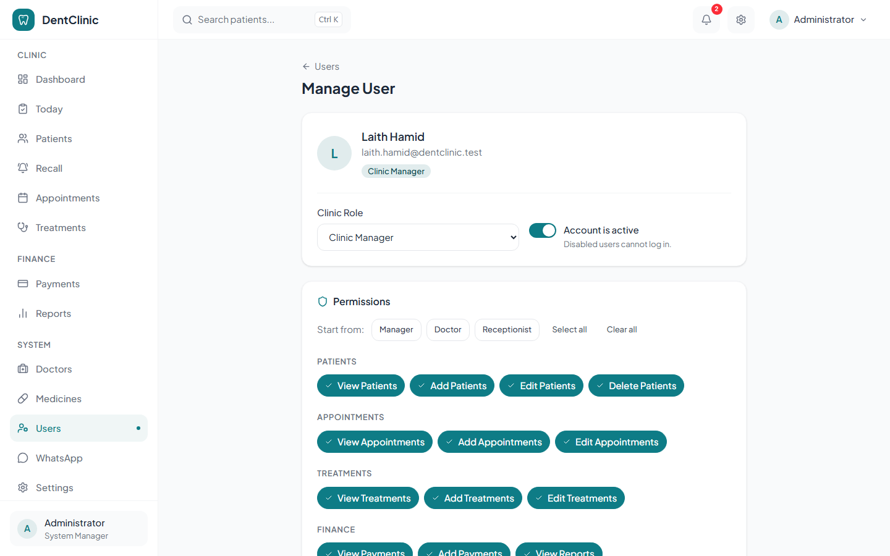</td>
</tr>
<tr>
<td colspan="2">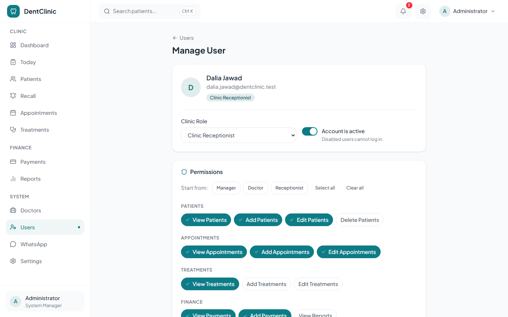<br>A read-only account: view rights kept, everything else revoked.</td>
</tr>
</table>

---

## Front end (this repository)

### Stack

| | |
|---|---|
| Framework | Next.js **16.2.9**, App Router, Turbopack |
| UI | React **19.2.4**, TypeScript 5 |
| Styling | Tailwind CSS **v4** (via `@tailwindcss/postcss`) |
| Icons | `lucide-react`, plus our own tooth logo |
| HTTP | `axios`, with cookies and the Frappe CSRF header |
| State | React Context (auth, clinic settings, session and permissions, toasts) — no external store |

### Routes

Press **Ctrl+K** (⌘K on a Mac), or use the search box in the top bar, to find a patient by name, phone
or ID from any page, or to jump to an everyday action such as New Appointment.

On a phone, every list turns into easy-to-read cards, and the Save button of a form stays at the bottom of the
screen.

Every screen checks the user's permission (see [Roles and permissions](#roles-and-permissions)) and hides
what they are not allowed to do.

| Route | What it does |
|---|---|
| `/` | Redirects to `/dashboard` |
| `/dashboard` | Today's appointments, the next 7 days, patient and plan counts, revenue this month, quick actions |
| `/today` | The front desk's day: today's patients by doctor, one tap to confirm, complete or mark a no-show, late patients highlighted, medical alerts and balances at a glance, quick payments and walk-ins. Marking a visit Completed (here or on the appointment) asks what was done and saves it on the patient's treatment plan |
| `/patients` | List with server-side search (name, phone, ID; a phone number is found however it was typed: `0770…`, `+964 770…`, `00964…` or Arabic digits), gender filter and paging |
| `/recall` | Patients due for a check-up (not seen for 6 months and nothing booked), with Call, WhatsApp reminder and Book |
| `/patients/new`, `/patients/[id]/edit` | Create or edit — basic details (an age instead of the birth date when the patient does not know it) plus medical history, allergies, medications. Every number and phone box in the app accepts digits typed on an Arabic keyboard and saves them as 0-9 |
| `/patients/[id]` | Medical alerts (allergies, blood thinners, diabetes, heart problems, pregnancy), tap-to-call and WhatsApp buttons, last visit, next appointment and balance, a timeline of visits, treatment sessions and payments, and tabs for appointments, treatment plans, payments and the dental chart, plus X-rays and photos (take a photo with the tablet camera or add files) |
| `/patients/[id]/estimate` | A printable treatment estimate of the patient's open plans, with totals and signature lines |
| `/patients/[id]/statement` | A printable statement of all treatments, payments and the balance |
| `/patients/[id]/chart` | The dental chart and its findings, ready to print for the patient file or a referral |
| `/appointments/[id]/card` | A printable appointment card to hand to the patient |
| `/payments/day` | The end-of-day report: payments by method, the total, and the cash that should be in the drawer |
| `/appointments` | The appointment book as a **day calendar** (a column per doctor, from opening to closing time, with a "now" line), a **week calendar**, or a **list** with search and filters. Click an empty time in the calendar to book it with the date, time and doctor already filled in, or drag an appointment to move it to another time or doctor |
| `/appointments/new`, `/appointments/[id]/edit` | Book or edit — shows the doctor's day with one-tap free times, remembers the last doctor used, and warns when the doctor is already booked at that time |
| `/appointments/[id]` | Detail, one-click status changes, WhatsApp messages sent for it |
| `/treatments` | Plans with cost and remaining balance, type and status filters |
| `/treatments/new`, `/treatments/[id]/edit` | Create or edit — type, FDI tooth number, diagnosis, cost |
| `/treatments/[id]` | Money summary with progress, status changes, its payments, and its treatment sessions, and the patient's dental chart opened at the plan's tooth |
| `/payments` | Ledger with search, method and date filters, and the total |
| `/payments/new`, `/payments/[id]/edit` | Record or edit a payment (pre-fills from a treatment plan; cannot go above what is left) |
| `/payments/[id]` | Printable receipt |
| `/reports` | Revenue by treatment, method and month for a chosen period, outstanding balances, CSV export |
| `/doctors` | The clinic's doctors: add and edit name, specialization, phone, email, working hours, and switch a doctor off when they leave |
| `/users`, `/users/[id]` | Staff accounts, roles, enable/disable, and the 14 permission switches with role presets |
| `/whatsapp` | Reminder templates with a live preview, and the message log |
| `/settings` | Clinic name and logo, contact details, currency (Iraqi dinars are shown without decimals), the phone country code (964 for Iraq, added to local numbers such as `0770…` in WhatsApp links), working hours, feature switches, and the clinic colour (the whole app follows it), and a price list that fills in treatment costs |
| `/profile` | My details and permissions, change password |

### Project structure

```
src/
├── app/                        one folder per route (see the table above)
│   ├── layout.tsx              root layout → providers → MainLayout
│   ├── page.tsx                redirects to /dashboard
│   ├── not-found.tsx           404 page
│   └── _login/page.tsx         login screen, parked out of routing (see below)
├── components/
│   ├── MainLayout.tsx          sidebar + topbar shell, and the login guard
│   ├── Sidebar.tsx · Topbar.tsx · NotificationBell.tsx
│   ├── Guard.tsx               hides a page from users without the permission
│   ├── DentalChart.tsx         odontogram: adult and child teeth, surfaces, conditions, notes
│   ├── forms/                  patient, appointment, treatment and payment forms (new + edit)
│   └── ui/                     shared cards, buttons, inputs, tables, badges, dialogs, pickers
├── context/                    auth, clinic settings, session/permissions, toast messages
└── lib/
    ├── frappe.ts               the only place that talks to the backend
    ├── mockData.ts             in-memory dummy dataset
    ├── types.ts                doctypes, allowed values, permission keys
    ├── hooks.ts                paged lists, single documents, doctors
    ├── format.ts · links.ts    money, dates, CSV; record URLs
docs/backend-todo.md            what the backend must provide for this front end
```

**The dental chart** (`DentalChart.tsx`) is an odontogram in FDI notation, with adult teeth (11–48) and
child teeth (51–85). Each tooth is drawn by type with its five surfaces (M, O, D, B, L). Click a tooth to
mark caries or fillings on its surfaces, whole-tooth conditions (crown, root canal, implant, bridge,
missing, to extract) and a note, see its treatment plans, or start a new treatment for it. **Save Chart**
stores it on the patient's `dental_chart` field; charts saved in the first, simpler format still load.

### The data layer

`src/lib/frappe.ts` exposes functions that mirror the Frappe REST API:

```ts
getList(doctype, fields, { filters, orFilters, orderBy, limit, start })  // GET  /api/resource/<Doctype>
getCount(doctype, filters?, orFilters?)                                   // frappe.client.get_count
getDoc(doctype, name)                                                     // GET  /api/resource/<Doctype>/<n>
createDoc(doctype, data)                                                  // POST /api/resource/<Doctype>
updateDoc(doctype, name, data)                                            // PUT  /api/resource/<Doctype>/<n>
deleteDoc(doctype, name)                                                  // DELETE
callMethod(method, args) · uploadFile(file) · changePassword(old, new)
```

Each call sends the CSRF token as `x-frappe-csrf-token`, with `withCredentials: true` so the Frappe
session cookie rides along. `errorMessage(err)` turns a failed call into a sentence the user can read.

**Dummy-data mode.** `MOCK_DATA = true` at the top of the file routes everything through
`src/lib/mockData.ts` instead — an in-memory store shaped like Frappe's REST responses: IDs use the
real naming series (`PAT-2026-00001`), link fields hold the linked doc's `name`, list queries return
only the requested fields and support filters, search, sorting and paging, and a missing doc rejects
the way a 404 would. It ships with 12 patients, 5 doctors, 24 appointments, 15 treatment plans, 10
treatment sessions, 15 payments, 9 users, clinic settings, and WhatsApp templates and logs. A few
appointments and payments are dated today, so the dashboard is never empty.

The money is *computed*, not hard-coded: payments sum into each plan's paid and remaining amounts,
and plans sum into each patient's totals. Add a payment and the plan, the patient card and the
reports all move together. Like the real backend, it refuses a payment above what a plan has left,
and refuses to delete a record that others link to. Writes live for the browser session and reset on
reload.

---

## Back end

Repository: **[ahmedraad51/clinic-system-backend](https://github.com/ahmedraad51/clinic-system-backend)** ·
Frappe app `dent_app` · MIT

### Doctypes

| Doctype | Naming | Key fields |
|---|---|---|
| **Patient** | `PAT-{YYYY}-{#####}` | `full_name`, `gender`, `date_of_birth`, `age`, `phone_number`, `secondary_phone`, `email`, `address`, `medical_history`, `allergies`, `current_medications`, `chronic_diseases`, `notes` — plus read-only rollups `total_appointments`, `total_treatments`, `total_paid`, `total_remaining` |
| **Doctor** | `DOC-{#####}` | `full_name`, `specialization` (General Dentist / Orthodontist / Endodontist / Periodontist / Oral Surgeon / Pediatric Dentist / Prosthodontist), `phone_number`, `email`, `working_days`, `start_time`, `end_time`, `is_active` |
| **Appointment** | `APT-{YYYY}-{#####}` | `patient`, `doctor`, `appointment_date`, `appointment_time`, `duration_minutes`, `status` (Scheduled / Confirmed / Completed / Cancelled / No Show), `reason_for_visit`, `notes` |
| **Treatment Plan** | `TRT-{YYYY}-{#####}` | `patient`, `doctor`, `treatment_type` (Filling / Root Canal / Crown / Bridge / Extraction / Implant / Cleaning / Whitening), `tooth_number`, `status` (Planned / In Progress / Completed / Cancelled), `diagnosis`, `treatment_notes`, `total_cost`, read-only `paid_amount` and `remaining_amount` |
| **Treatment Session** | `SES-{YYYY}-{#####}` | `patient`, `treatment_plan`, `doctor`, `session_date`, `session_time`, `status`, `notes` |
| **Payment** | `PAY-{YYYY}-{#####}` | `patient`, `treatment_plan`, `payment_date`, `amount`, `payment_method` (Cash / Card / Bank Transfer), `notes` |
| **Clinic Permission** | one per `user` | 14 checkboxes: view/add/edit/delete patients, view/add/edit appointments, view/add/edit treatments, view/add payments, view reports, manage users |
| **Clinic Settings** | single | `clinic_name`, `logo`, contact details, `currency`, `tax_number`, `phone_country_code`, working hours, `theme_color`, and feature switches for WhatsApp, the patient portal and financial reports |
| **WhatsApp Template** | `WAT-{#####}` | `template_name`, `trigger` (24 Hours Before / 2 Hours Before / Manual), `message`, `is_active` |
| **WhatsApp Log** | `WAL-{YYYY}-{#####}` | `patient`, `appointment`, `phone_number`, `status` (Sent / Failed / Pending), `sent_at`, `message`, `error_message` |

Balances are kept correct server-side: `Treatment Plan.validate()` recomputes `remaining_amount` and
refuses a paid amount greater than the total cost, then re-saves the linked patient so the rollups on
the patient record stay in step.

### Roles and permissions

Three roles ship as fixtures — **Clinic Manager**, **Clinic Doctor**, **Clinic Receptionist** — and
`Clinic Permission` layers the fine-grained switches on top, one record per user. That is exactly
what the `/users/[id]` screen edits. The front end hides menus, pages and buttons the user may not
use; System Managers can do everything. The backend must still enforce the same rules.

### Reports, dashboards and WhatsApp

- **Query reports:** Daily Revenue, Monthly Revenue, Treatment Revenue, Outstanding Balances
- **Dashboard:** a *Clinic Dashboard* with Appointments Today, Monthly Revenue and Outstanding Balance charts, plus a *Dental Clinic* workspace
- **WhatsApp reminders:** `dent_app.dent_app.whatsapp.schedule_reminders` runs hourly, picks the active template for each trigger window, fills it from the appointment and logs the result to WhatsApp Log

---

## Getting started

### Front end only (dummy data — no backend needed)

```bash
git clone https://github.com/its14march/clinic-system-Front.git
cd clinic-system-Front
npm install
npm run dev
```

Open <http://localhost:3000> — it redirects straight to the dashboard, already populated.
Node **20.9+** is required (developed on Node 22).

### Checks and tests

```bash
npx tsc --noEmit          # type check
npm run lint              # ESLint
npm run build             # production build
npx playwright install chromium   # once, before the first test run
npm run test:e2e          # browser tests (builds, then serves on port 3100)
npm run screenshots       # every page at desktop, tablet and phone size, into screenshots/
npm run screenshots:readme   # the pictures in this README, into docs/screenshots/
```

The browser tests walk through the daily work: adding a patient, booking an appointment (and the
"doctor is already booked" warning), creating a treatment plan and paying part of it, and checking that a
receptionist cannot open Reports.

### Back end

```bash
cd $PATH_TO_YOUR_BENCH
bench get-app https://github.com/ahmedraad51/clinic-system-backend --branch version-16
bench install-app dent_app
bench start
```

The front end expects the site to answer at `http://dent_clinic.localhost:8000`. If yours differs,
set `FRAPPE_URL` before starting the front end, for example in `.env.local`:

```bash
FRAPPE_URL=http://<your-site>:8000
```

Before switching over, work through [`docs/backend-todo.md`](docs/backend-todo.md): a few fields
(like `Patient.dental_chart` and the `patient_name` fetch fields) and read permissions must exist on
the backend first.

---

## Running against the real backend

Two independent switches, both currently set for offline development:

**1. Turn dummy data off** — [`src/lib/frappe.ts`](src/lib/frappe.ts):

```ts
export const MOCK_DATA: boolean = false;
```

**2. Turn login back on** — [`src/context/AuthContext.tsx`](src/context/AuthContext.tsx):

```ts
const AUTH_DISABLED: boolean = false;
```

…then move the login page back into routing:

```bash
git mv src/app/_login src/app/login
```

The leading underscore makes `_login` a Next.js *private folder*, so the route is not published while
the code stays intact. With `AUTH_DISABLED = true` the app uses a stand-in `Administrator` session
(so the login guard in `MainLayout` never fires) and hides the logout buttons, since there would be
nowhere to log out to. The guard waits for the saved session to load, so refreshing a page keeps you
logged in.

Logging in posts to `/api/method/login` and relies on the Frappe session cookie for everything after that. It
then asks Frappe who is logged in, so a cookie the browser did not keep shows up at once. Switch off "Keep me
logged in on this computer" on shared computers: closing the browser then logs you out. When the session
expires, a "Log in again" dialog opens over the page, so nothing typed is lost; logging out from there goes
to the login page and afterwards back to the page you were on. Every request gives up after 15 seconds (file
uploads after 2 minutes, full lists for totals after 1 minute) with a clear message, and a list that got no
answer, or found the server down, is asked for again. See section 5 of
[`docs/backend-todo.md`](docs/backend-todo.md) about the CSRF token.

---

## Known gaps

Worth knowing before you pick this up:

- **The backend needs a few additions** before `MOCK_DATA` can be turned off — see
  [`docs/backend-todo.md`](docs/backend-todo.md), including the CSRF token after login.
- **Totals are added up in the browser** for the dashboard and reports. Fine for one clinic; backend
  report methods would be faster for very large data.
- **English only for now.** The layout uses start/end spacing, so an Arabic right-to-left version can be
  added without redoing the screens.
- The patient portal switch is saved in Settings but not used yet.
