# Design options

Three new looks for DentClinic. Each one has its own colour for every part of the clinic (patients,
appointments, treatments, money, reports), icons in coloured tiles, drawn avatars for patients and doctors
(doctors can upload a photo instead), charts on the dashboard and small, calm animations. The tooth logo stays,
and text and buttons stay large enough to read and tap on a tablet.

Try them in the app: **My Profile → Design Option** (only your computer changes). Then answer **a**, **b** or
**c**.

| | Option A: Fresh Mint | Option B: Midnight | Option C: Sunrise |
|---|---|---|---|
| In one sentence | Light and airy: a white menu with pastel icon tiles, soft pastel number cards and a mint glow behind the page, calm and clean like a modern clinic. | Bold and modern: a dark night-blue menu with glowing icons, a colourful welcome banner and crisp white cards, like a professional app. | Warm and friendly: a cream background, rounded pill buttons and big solid-colour number tiles with white text, cheerful and easy to read from a distance. |
| Main colour | Teal | Indigo | Warm orange |
| Font | Plus Jakarta Sans | Manrope | Nunito (rounded) |
| Dashboard | 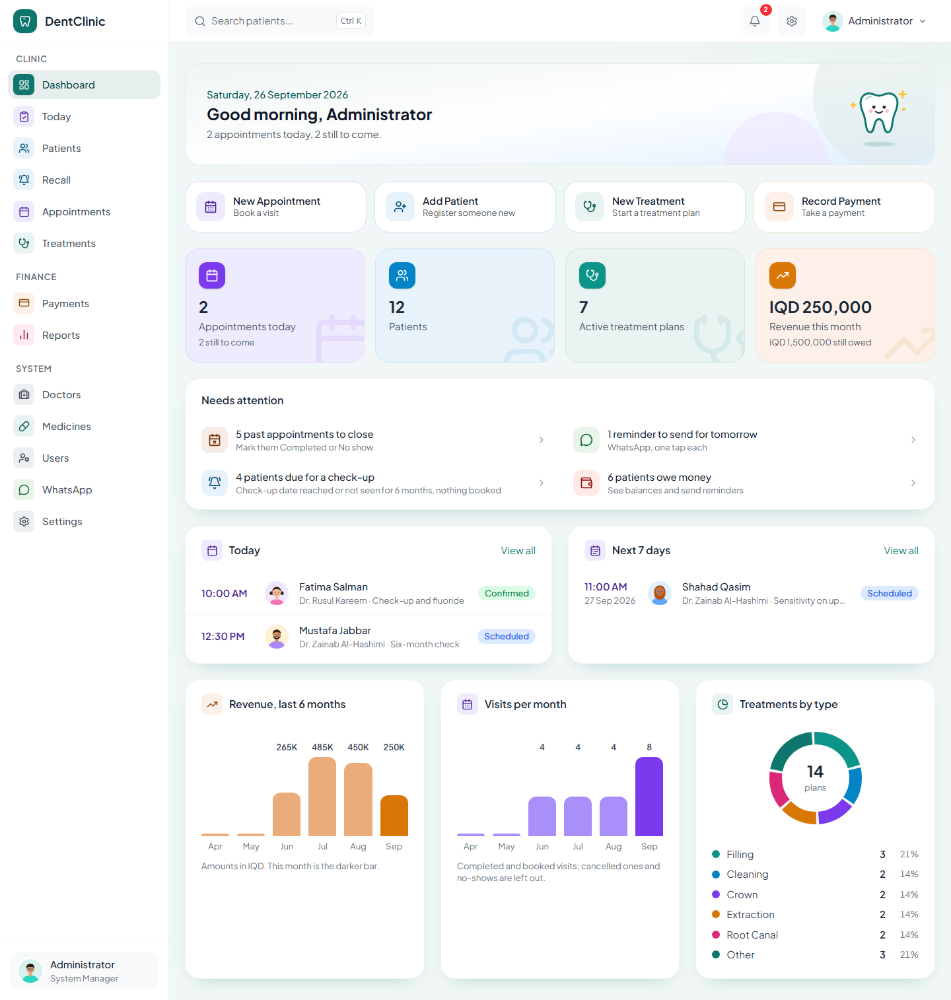 | 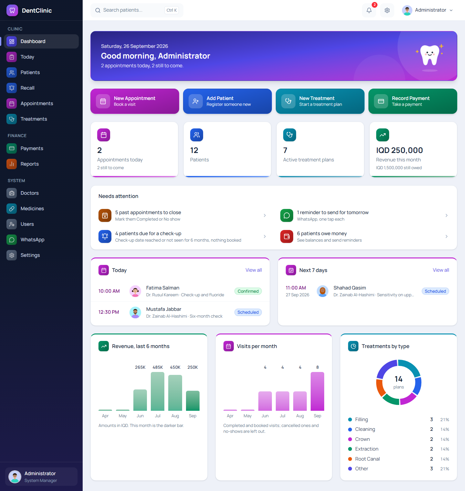 | 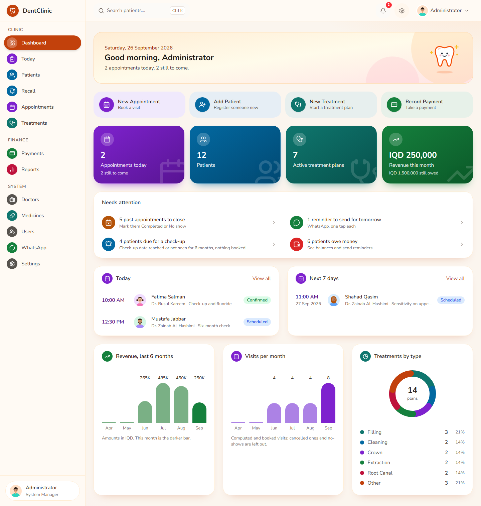 |
| Patient page | 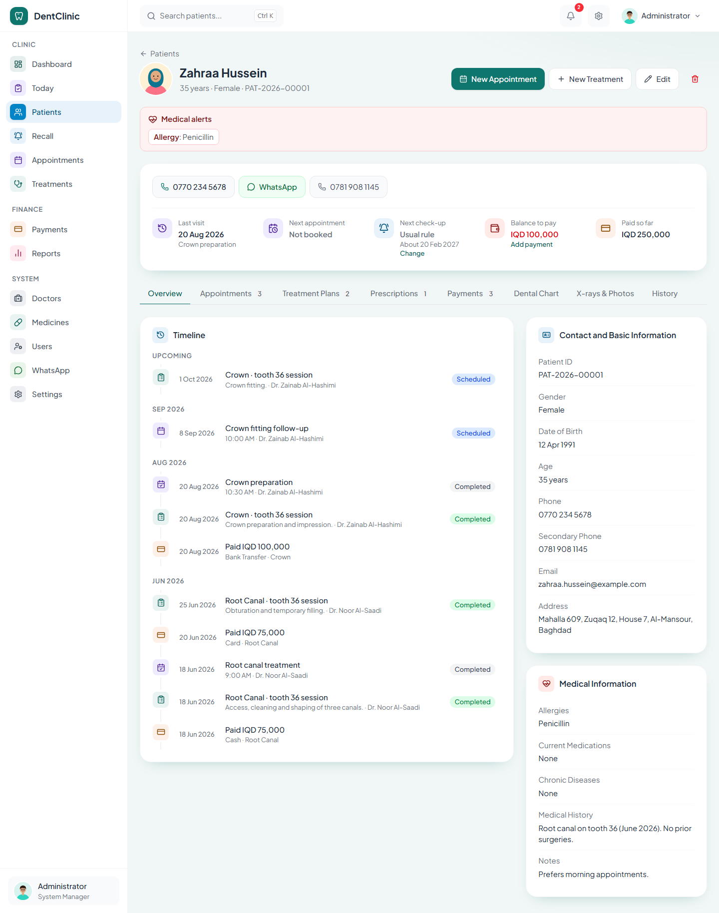 | 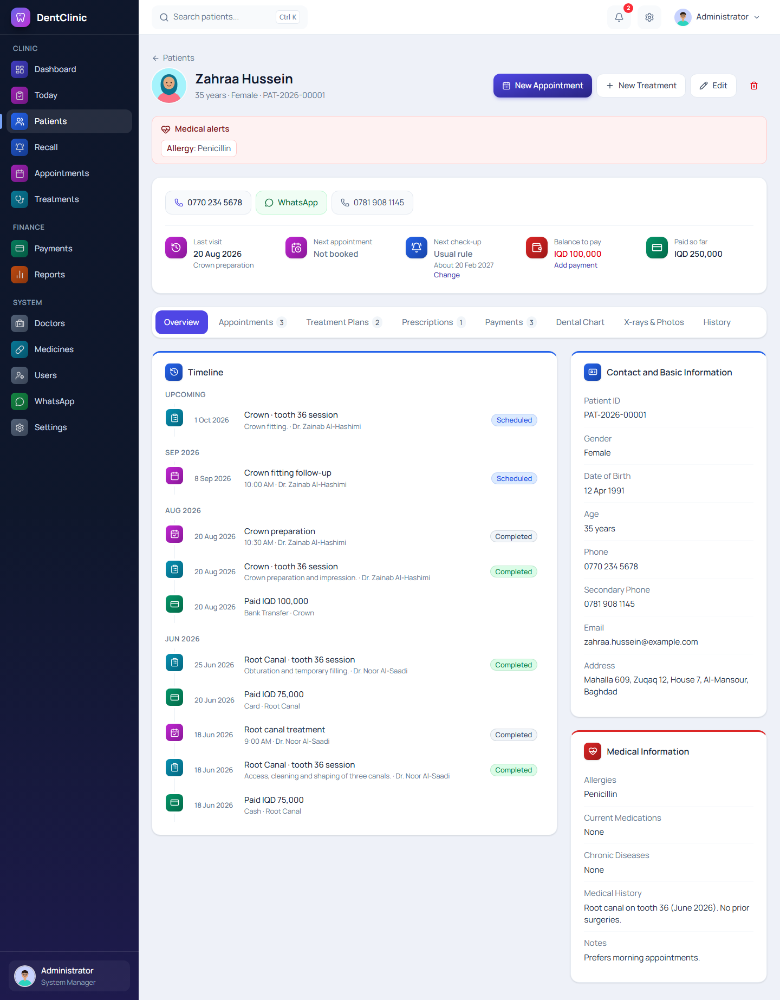 | 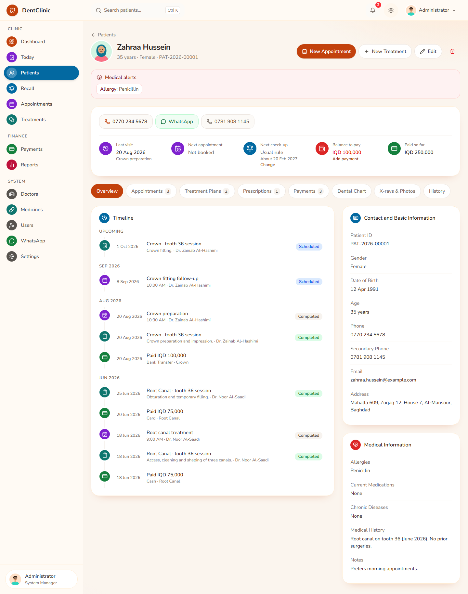 |
| Calendar | 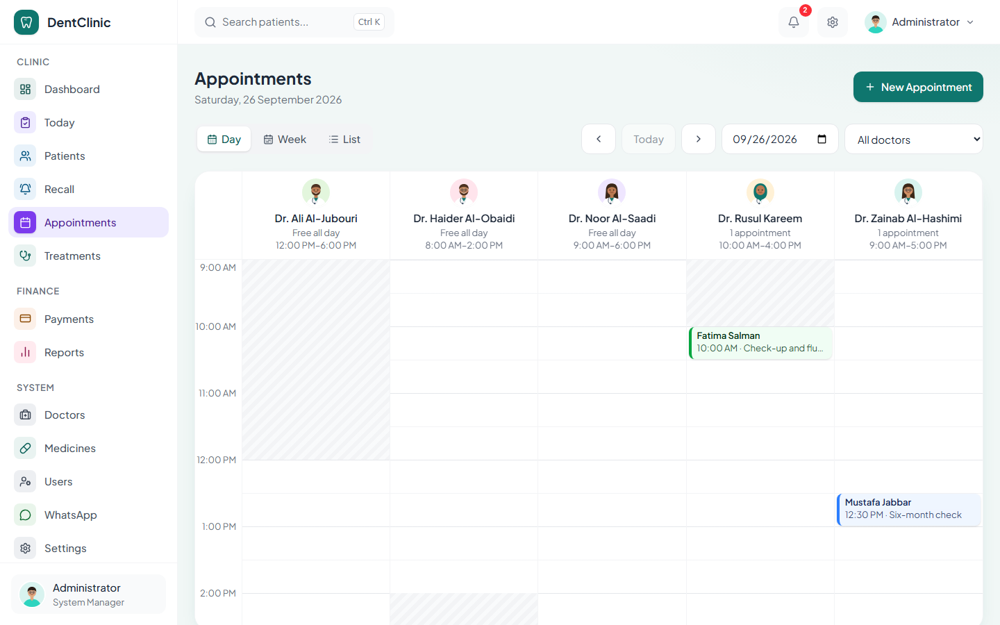 | 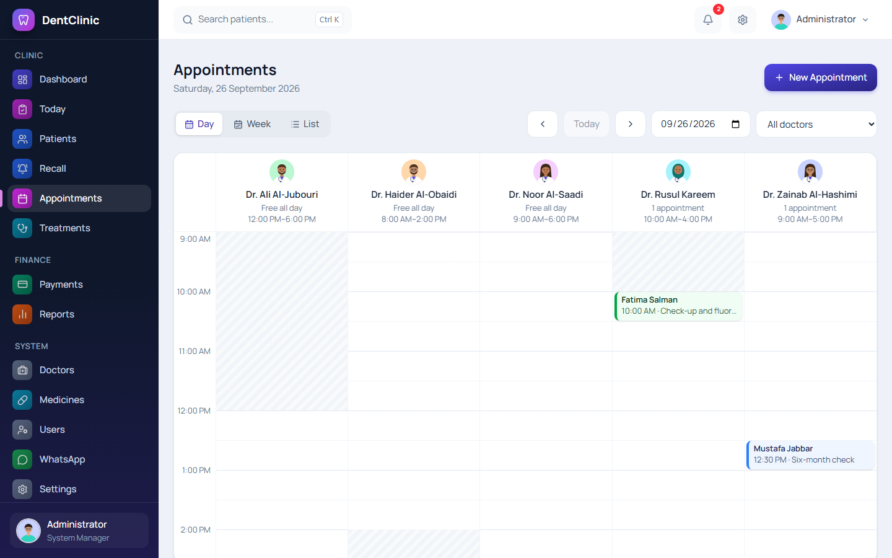 | 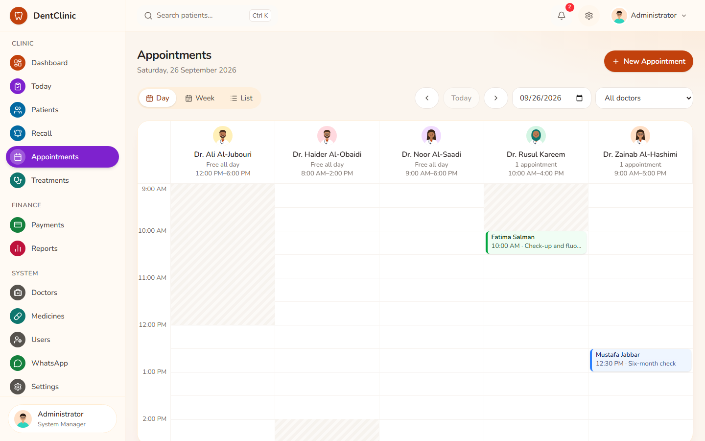 |
| Today board | 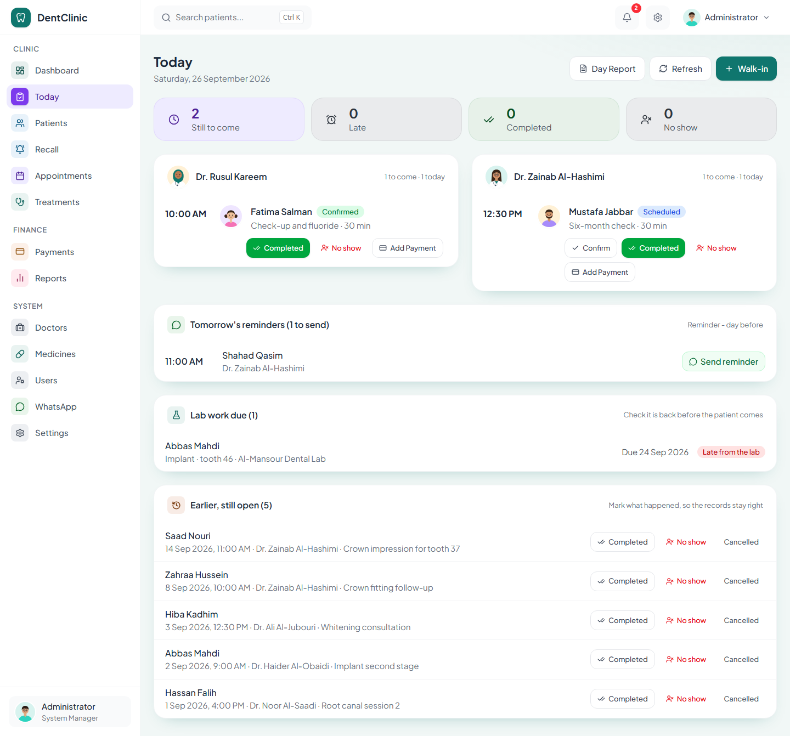 | 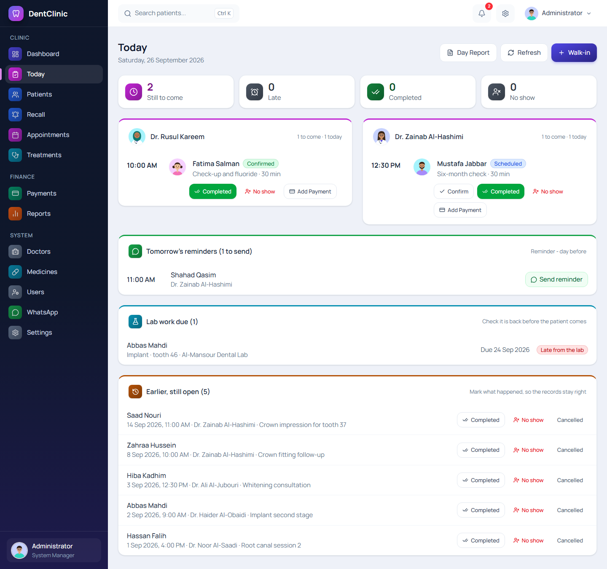 | 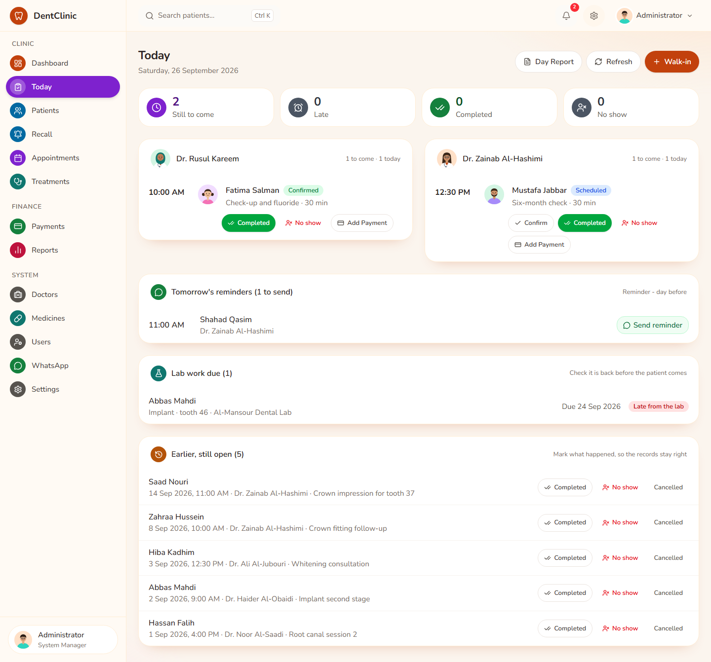 |
| Phone | 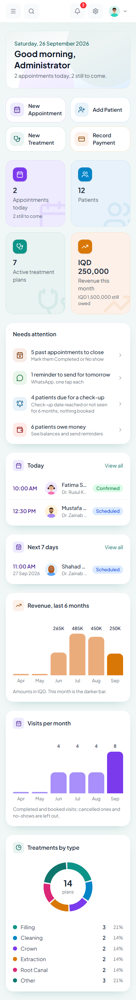 | 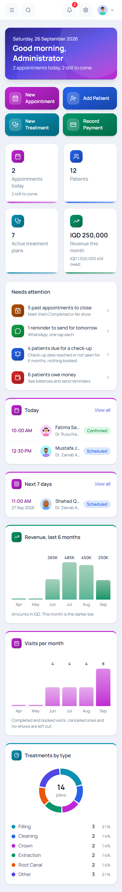 | 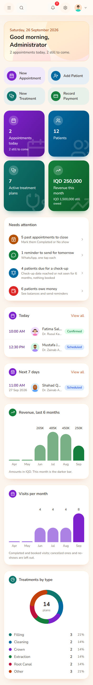 |

Colours of each part of the clinic:

| | Patients | Appointments | Treatments | Money | Reports |
|---|---|---|---|---|---|
| A | sky blue | violet | teal | amber | pink |
| B | blue | magenta | cyan | emerald | orange |
| C | deep blue | purple | deep teal | green | rose |

The pictures are made with `npm run screenshots:designs` (dummy data, 26 September 2026).
