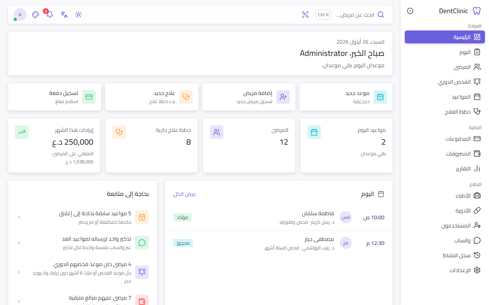
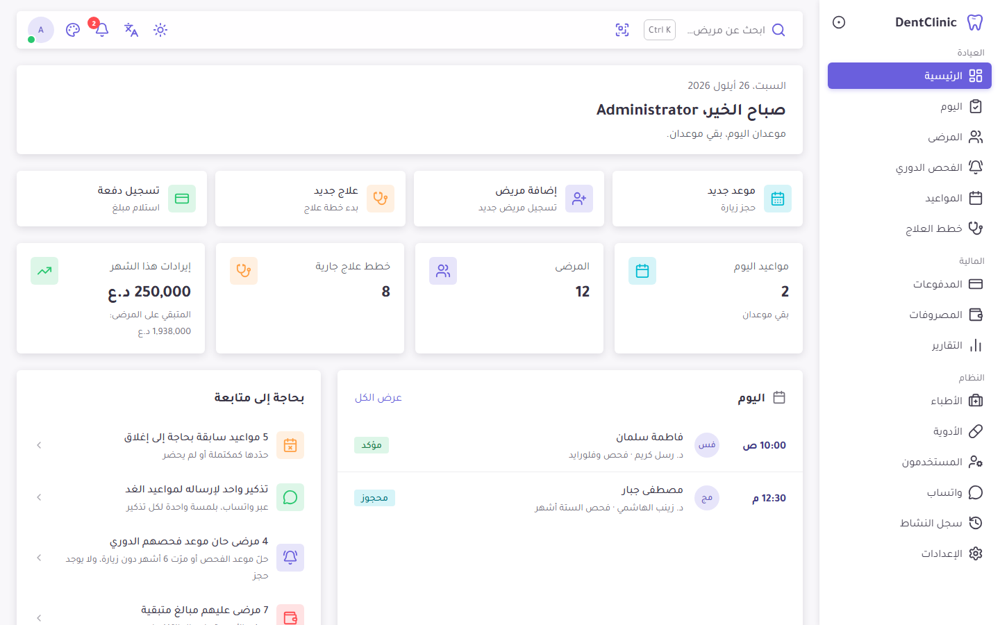
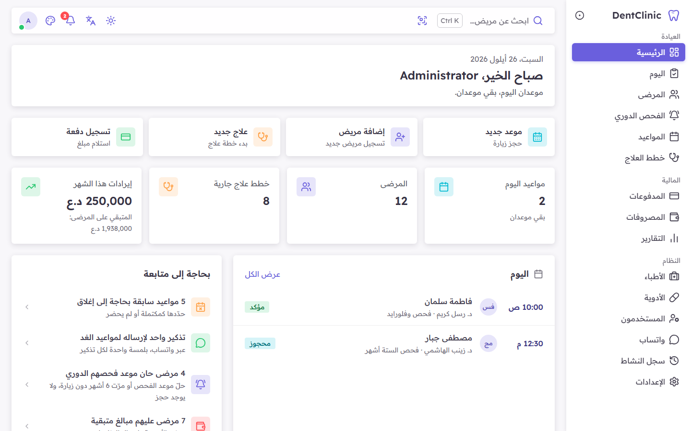

# Font comparison

Four fonts that work for both Arabic and English, each shown on the dashboard and on a patient page, in Arabic and in
English (1440 × 900, dummy data, 1 October 2026). Nothing else changes between the pictures: the same sizes, the
same semibold headings and the same colours. **Please choose one**; it will then be built into the app the same way
as the current one (the font files are part of the app, so they never depend on Google Fonts).

Retake the pictures with `npm run screenshots:fonts` (`e2e/fonts/fonts.spec.ts`).

| | Arabic: dashboard | Arabic: patient | English: dashboard | English: patient |
|---|---|---|---|---|
| **1. IBM Plex Sans Arabic** (now) | [picture](1-ibm-plex-sans-arabic-ar-dashboard.png) | [picture](1-ibm-plex-sans-arabic-ar-patient.png) | [picture](1-ibm-plex-sans-arabic-en-dashboard.png) | [picture](1-ibm-plex-sans-arabic-en-patient.png) |
| **2. Cairo** | [picture](2-cairo-ar-dashboard.png) | [picture](2-cairo-ar-patient.png) | [picture](2-cairo-en-dashboard.png) | [picture](2-cairo-en-patient.png) |
| **3. Tajawal** | [picture](3-tajawal-ar-dashboard.png) | [picture](3-tajawal-ar-patient.png) | [picture](3-tajawal-en-dashboard.png) | [picture](3-tajawal-en-patient.png) |
| **4. Readex Pro** | [picture](4-readex-pro-ar-dashboard.png) | [picture](4-readex-pro-ar-patient.png) | [picture](4-readex-pro-en-dashboard.png) | [picture](4-readex-pro-en-patient.png) |

## The four fonts

1. **IBM Plex Sans Arabic** (what the app uses now). Calm and clear, with simple letter shapes; in English the app
   uses its partner IBM Plex Sans, so both languages look like one family. The narrowest of the four, so long names
   and tables fit best. Has every weight the app uses (regular, medium, semibold).
2. **Cairo.** Rounder, with open, friendly letters; very common in Arabic apps and websites. Its English letters look
   a little larger than the others at the same size. Has every weight the app uses.
3. **Tajawal.** Light, with low, simple Arabic letters that look smaller and thinner than the others at the same
   size. It has no semibold, so headings are drawn in bold (one step heavier than in the other pictures).
4. **Readex Pro.** Made for easy reading: wide letters with generous space between them, and strong, dark text.
   Takes the most room.

Cairo, Tajawal and Readex Pro are a little wider than IBM Plex in Arabic, so a long line wraps sooner (see the last
hint in the dashboard's "Needs attention" card).

